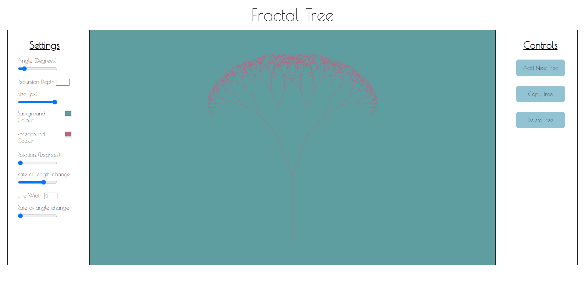
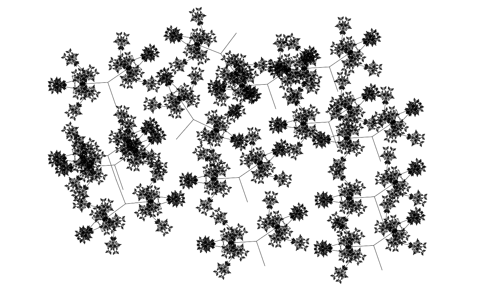

# Fractal-Tree

## Overview

Fractal tree art editor in HTML5 and JS. The goal of this project was initially to expand my knowledge of JavaScript but rapidly turned into adding as many configuration options to fractal tree generation as possible. This is now to the point where you can make semi-generative fractal art by playing around with the properties of the trees and placing multiple trees in the canvas. Examples of this can be found in ./img/. To run the program, download the source and open ./fractal-tree.html in a HTML5 compatible browser.

## Configurable properties

Here is a list of the various options present in the left-hand options area and what they translate to.

- Angle - The angle between the two offshoots of each branch. This value remains constant assuming that the Rate of Angle change is set to 1 (default)
- Recursion Depth - The amount of times more branches will be recursively created before it stops. Currently, this is maxed at 11
- Size - The overall size of the tree
- Background Colour - Global canvas background colour
- Foreground Colour - Line colour of the selected tree
- Rotation - Orientation of the selected tree
- Rate of length change - multiplier that gets applied to each subsequent branches in the recursion depth. Default is less than 1 to make the branches get slightly smaller each time.
- Line width - thickness of the line to draw the selected tree
- Rate of angle change - similar to the Rate of Length change but applied to the Angle. The default is 1 ie no change and kept at a constant angle.

## Other Features

- Position trees by dragging. Currently selected tree will appear with a dashed square as its border.
- Spawn new trees. New trees will have the default settings as shown in the screenshot above
- Copy the currently selected tree. The copy will preserve all the properties of the copied tree and will be positioned in the centre of the canvas
- Delete the currently selected tree

## Examples

